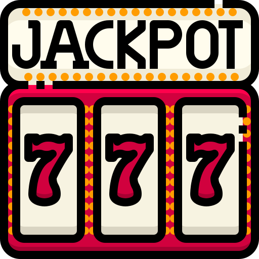

# Slot Machine

Slot machine game created with PixiJS.

## About

This is a simple slot machine game built using PixiJS, a 2D WebGL rendering library. It provides a fun and interactive experience for players to try their luck and see if they can win big!

## Demo

To experience the application in action, simply click on the following link: [SLOT GAME](https://slot-machine.netlify.app/). This will redirect you to the live demo where you can interact with the application and explore its features firsthand.

## Installation

To run the game locally, make sure you have [Node.js](https://nodejs.org/) installed. Then, follow these steps:

1. Clone the repository:

   ```bash
   git clone https://github.com/vascabarkapa/slot-machine.git
   ```

2. Set up the environment variables for backend:

   ```bash
   PORT="Specifies the port on which your application will listen for HTTP requests"
   API_URL="Specifies the URL of your API service, e.g. http://localhost:5000/"
   FRONT_URL="URL for the frontend application, e.g. http://localhost:8080/"
   ```

3. Navigate to the project directory:

   ```bash
   cd slot-machine
   ```

4. Install the dependencies for the backend:

   ```bash
   npm install
   ```

5. Start the backend server:

   ```bash
   npm start
   ```

6. Then navigate to the frontend directory:

   ```bash
   cd app
   ```

7. Install the dependencies for the frontend:W

   ```bash
   npm install
   ```

8. Start the frontend development server:

   ```bash
   npm start
   ```

10. In the app's configuration file `app/configs/constants.js`, you have the option to adjust the **NUMBER_OF_SYMBOLS** field. This setting determines the quantity of symbols displayed in the game, thereby influencing the game's difficulty level.

9. Open your web browser and visit [http://localhost:8000](http://localhost:8000) to play the game.

## Contributing

Contributions are welcome! If you find any bugs or have suggestions for improvements, please open an issue or submit a pull request.

## License

This project is licensed under the MIT license. See the [LICENSE](LICENSE) file for more details.
